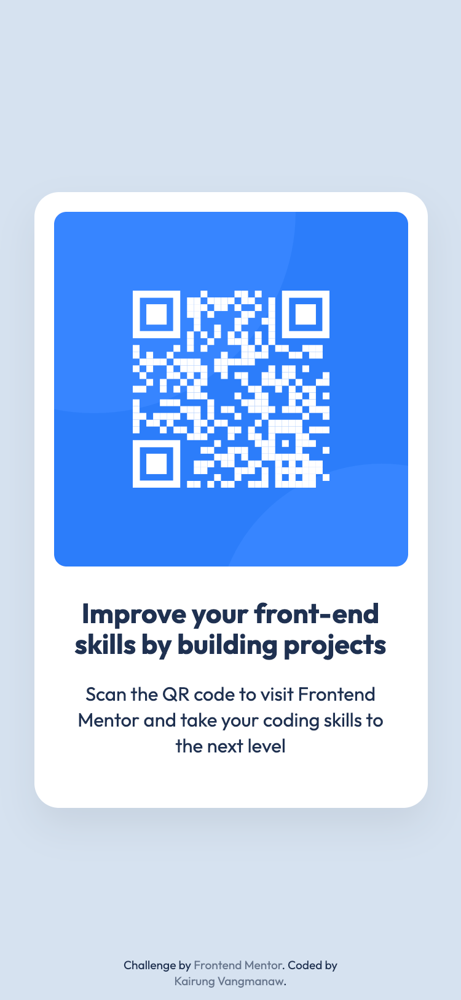

# Frontend Mentor - QR code component solution


This is a solution to the [QR code component challenge on Frontend Mentor](https://www.frontendmentor.io/challenges/qr-code-component-iux_sIO_H). Frontend Mentor challenges help you improve your coding skills by building realistic projects. 

## Table of contents

- [Frontend Mentor - QR code component solution](#frontend-mentor---qr-code-component-solution)
  - [Table of contents](#table-of-contents)
  - [Overview](#overview)
    - [Screenshot](#screenshot)
    - [Links](#links)
  - [My process](#my-process)
    - [Built with](#built-with)
    - [What I learned](#what-i-learned)
    - [Continued development](#continued-development)
    - [Useful resources](#useful-resources)
    - [AI Collaboration](#ai-collaboration)
  - [Author](#author)
  - [Acknowledgments](#acknowledgments)

## Overview

### Screenshot
<details>
  
  <summary>
  Mobile view
  </summary>
    
</details>

<details>
  <summary>Desktop view</summary>
  
</details>

### Links

- Solution URL: [QR code component challenge solution using React, Vite, and BEM CSS](https://www.frontendmentor.io/solutions/test-XhVroO-R_F)
- Live Site URL: [qr-code-component](https://github.com/challenged-by-frontend-mentor/qr-code-component/tree/main)

## My process

### Built with

- Semantic HTML5 markup
- CSS custom properties (Variables)
- Flexbox for layout and centering
- [BEM Methodology](https://getbem.com/) for CSS naming conventions
- [React](https://react.dev/) - JS library for building user interfaces
- [Vite](https://vitejs.dev/) - Next Generation Frontend Tooling
- **Pixel-perfect workflow:** Image overlay techniques & macOS Preview tool for precise pixel measurement

### What I learned
1. **Refactoring to React & Modular Architecture:** 
   I refactored the original vanilla HTML/CSS implementation into modular React components (`<Card />` and `<Footer />`), improving code reusability and maintainability.

2. **Clean Centering with Flexbox:** 
   Instead of relying heavily on `position: absolute` with `translate` to center the main card, I learned how to utilize Flexbox on the `body` container to achieve a clean, responsive dead-center layout:

   ```css
   body {
     min-height: 100vh;
     display: flex;
     flex-direction: column;
     align-items: center;
     justify-content: center;
   }
3. **Strict BEM Naming Conventions:**
    I refined my CSS selector structure to strictly adhere to BEM (Block Element Modifier) standards, using clean Block scopes like `.card`, `.card__qr-code`, and `.card__content`.

### Continued development

- Deepen understanding of responsive layouts and advanced CSS Grid/Flexbox techniques.
- Continue implementing BEM methodology and CSS design systems in larger React projects.
- Focus on web accessibility (a11y) best practices, such as descriptive `alt` texts for screen readers.

### Useful resources

- [drop-shadow() - CSS | MDN](https://developer.mozilla.org/en-US/docs/Web/CSS/filter-function/drop-shadow) - This helped me clarify the properties of drop-shadow function in CSS.

### AI Collaboration

Throughout this challenge, I collaborated with Gemini to review my implementation:

- CSS Layout Optimization: Discussed various methods for centering elements and resolved layout edge cases regarding fixed heights vs. content-driven expansion.
- BEM Refactoring: Evaluated and corrected class naming structures to ensure full compliance with BEM standards.
- Code Quality Check: Verified Accessibility attributes (e.g., meaningful image alt texts) and React JSX attribute syntax (className).

## Author
- GitHub: [Kairung Vangmanaw](https://github.com/VangmanawKairung)
- Frontend Mentor - [@VangmanawKairung](https://www.frontendmentor.io/profile/VangmanawKairung)

## Acknowledgments
I want to thank the **Frontend Mentor team** for providing this great design challenge. A big thanks to **Google** for developing **Gemini**, which served as an insightful coding assistant during code reviews and refactoring. 

Special credit to my practical pixel-perfect workflow using **macOS Preview** for accurate pixel measurements and image overlay techniques to ensure the implementation stays true to the original design. Lastly, appreciation to myself for staying persistent and continually pushing my front-end development skills forward!
