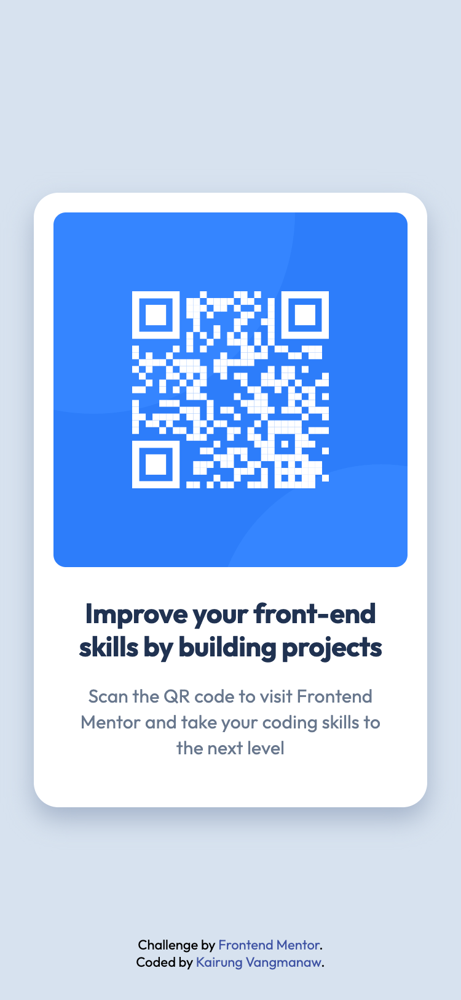

# Frontend Mentor - QR code component solution

This is a solution to the [QR code component challenge on Frontend Mentor](https://www.frontendmentor.io/challenges/qr-code-component-iux_sIO_H). Frontend Mentor challenges help you improve your coding skills by building realistic projects.

## Table of contents

- [Overview](#overview)
  - [Screenshot](#screenshot)
  - [Links](#links)
- [My process](#my-process)
  - [Built with](#built-with)
  - [What I learned](#what-i-learned)
  - [Continued development](#continued-development)
  - [Useful resources](#useful-resources)
- [Author](#author)
- [Acknowledgments](#acknowledgments)

## Overview

### Screenshot

- Mobile view

  

- Desktop view

  

### Links

- Solution URL: [Add solution URL here](https://your-solution-url.com)
- Live Site URL: [Frontend Mentor Challenge | QR code component](vangmanawkairung.github.io/frontend-mentor-qr-code-component/)

## My process

### Built with

- Semantic HTML5 markup
- CSS custom properties
- Flexbox
- Mobile-first workflow

### What I learned

I learned how to use the `drop-shadow` function of the CSS `filter` property. I discovered that it is quite similar to the `box-shadow` property.

### Continued development

I will continue to study the use of the `filter` property because I believe it can reduce my workload and make things more convenient.

### Useful resources

- [drop-shadow() - CSS | MDN](https://developer.mozilla.org/en-US/docs/Web/CSS/filter-function/drop-shadow) - This helped me clarify the properties of drop-shadow function in CSS.

## Author

- GitHub: [Kirung Vangmanaw](https://github.com/VangmanawKairung)
- Frontend Mentor - [@VangmanawKairung](https://www.frontendmentor.io/profile/VangmanawKairunge)

## Acknowledgments

I would like to sincerely thank myself for staying persistent and continuing to push forward. A big thank you to the **Frontend Mentor team** for creating this challenge and giving me the opportunity to practice and improve my skills. I am also grateful to **OpenAI** and **Google** for developing **ChatGPT** and **Gemini**, which helped me complete this challenge and explore new techniques. A special thanks to **Figma** for providing an intuitive design tool that made translating designs into code much smoother. Lastly, I want to express my appreciation to every tool, program, and source of encouragement that supported me throughout this process. Without them, completing this challenge successfully would not have been possible.
